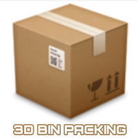

# 3D-Bin-Packing


[](./LICENSE)

Based on Intelligent FIRST-FIT box placement having maximal spacing covered. What this code does is simple, it fits most of the 3D boxes in more than one 3D containers. In other words, it attempts to match a set of 3D items to one or more in a set of 3D containers. [See them in action here].
Make sure you have must have Java JDK 11 installed.

```
java --version
java 11.0.2 2019-01-15 LTS
Java(TM) SE Runtime Environment 18.9 (build 11.0.2+9-LTS)
Java HotSpot(TM) 64-Bit Server VM 18.9 (build 11.0.2+9-LTS, mixed mode)

```

### Usage Instructions
boxes.csv

containers.csv


### Output Format

```
java Test


###---LEAST NUMBER OF BOXES---###
List of boxes may or maynot fit:-
Box [id=4, Name=107NP, Volume=1105650.0, Weight=4.335, X =27.0, Y =315.0, Z =130.0]
Box [id=4, Name=107NP, Volume=1105650.0, Weight=4.335, X =27.0, Y =315.0, Z =130.0]
Box [id=4, Name=107NP, Volume=1105650.0, Weight=4.335, X =27.0, Y =315.0, Z =130.0]
Box [id=11, Name=BP500, Volume=1424500.0, Weight=1.412, X =35.0, Y =370.0, Z =110.0]
Box [id=11, Name=BP500, Volume=1424500.0, Weight=1.412, X =35.0, Y =370.0, Z =110.0]
Box [id=11, Name=BP500, Volume=1424500.0, Weight=1.412, X =35.0, Y =370.0, Z =110.0]
Box [id=11, Name=BP500, Volume=1424500.0, Weight=1.412, X =35.0, Y =370.0, Z =110.0]
Box [id=11, Name=BP500, Volume=1424500.0, Weight=1.412, X =35.0, Y =370.0, Z =110.0]
Box [id=6, Name=1264NP, Volume=2079000.0, Weight=2.9, X =35.0, Y =360.0, Z =165.0]
Box [id=6, Name=1264NP, Volume=2079000.0, Weight=2.9, X =35.0, Y =360.0, Z =165.0]
Box [id=6, Name=1264NP, Volume=2079000.0, Weight=2.9, X =35.0, Y =360.0, Z =165.0]
Box [id=6, Name=1264NP, Volume=2079000.0, Weight=2.9, X =35.0, Y =360.0, Z =165.0]
Box [id=6, Name=1264NP, Volume=2079000.0, Weight=2.9, X =35.0, Y =360.0, Z =165.0]
Box [id=3, Name=1059GP, Volume=3941208.0, Weight=1.75, X =86.0, Y =268.0, Z =171.0]
Box [id=3, Name=1059GP, Volume=3941208.0, Weight=1.75, X =86.0, Y =268.0, Z =171.0]

The boxes and containers are:-
Container ID:1 Container Name:34x30x18  BoxDetails:Box [id=2, Name=104NP, Volume=430000.0, Weight=1.6, size=215.0 X 20.0 X 100.0 ,(X,Y)=0.0,0.0 ,level=1]
Container ID:1 Container Name:34x30x18  BoxDetails:Box [id=2, Name=104NP, Volume=430000.0, Weight=1.6, size=215.0 X 20.0 X 100.0 ,(X,Y)=0.0,20.0 ,level=1]
Container ID:1 Container Name:34x30x18  BoxDetails:Box [id=2, Name=104NP, Volume=430000.0, Weight=1.6, size=215.0 X 20.0 X 100.0 ,(X,Y)=0.0,40.0 ,level=1]
Container ID:1 Container Name:34x30x18  BoxDetails:Box [id=2, Name=104NP, Volume=430000.0, Weight=1.6, size=215.0 X 20.0 X 100.0 ,(X,Y)=0.0,0.0 ,level=2]
Container ID:1 Container Name:34x30x18  BoxDetails:Box [id=2, Name=104NP, Volume=430000.0, Weight=1.6, size=215.0 X 20.0 X 100.0 ,(X,Y)=0.0,20.0 ,level=2]
Container ID:1 Container Name:34x30x18  BoxDetails:Box [id=10, Name=BP200, Volume=2258280.0, Weight=2.046, size=340.0 X 81.0 X 82.0 ,(X,Y)=0.0,40.0 ,level=2]
Container ID:1 Container Name:34x30x18  BoxDetails:Box [id=10, Name=BP200, Volume=2258280.0, Weight=2.046, size=340.0 X 81.0 X 82.0 ,(X,Y)=0.0,0.0 ,level=3]

Container ID:2 Container Name:42x23x15  BoxDetails:Box [id=7, Name=1884NP, Volume=112500.0, Weight=5.35, size=25.0 X 100.0 X 45.0 ,(X,Y)=0.0,0.0 ,level=1]
Container ID:2 Container Name:42x23x15  BoxDetails:Box [id=7, Name=1884NP, Volume=112500.0, Weight=5.35, size=25.0 X 100.0 X 45.0 ,(X,Y)=25.0,0.0 ,level=1]
Container ID:2 Container Name:42x23x15  BoxDetails:Box [id=7, Name=1884NP, Volume=112500.0, Weight=5.35, size=25.0 X 100.0 X 45.0 ,(X,Y)=50.0,0.0 ,level=1]
Container ID:2 Container Name:42x23x15  BoxDetails:Box [id=7, Name=1884NP, Volume=112500.0, Weight=5.35, size=25.0 X 100.0 X 45.0 ,(X,Y)=75.0,0.0 ,level=1]
Container ID:2 Container Name:42x23x15  BoxDetails:Box [id=8, Name=1984NP, Volume=154224.0, Weight=0.5, size=28.0 X 102.0 X 54.0 ,(X,Y)=100.0,0.0 ,level=1]
Container ID:2 Container Name:42x23x15  BoxDetails:Box [id=8, Name=1984NP, Volume=154224.0, Weight=0.5, size=28.0 X 102.0 X 54.0 ,(X,Y)=128.0,0.0 ,level=1]
Container ID:2 Container Name:42x23x15  BoxDetails:Box [id=8, Name=1984NP, Volume=154224.0, Weight=0.5, size=28.0 X 102.0 X 54.0 ,(X,Y)=156.0,0.0 ,level=1]
Container ID:2 Container Name:42x23x15  BoxDetails:Box [id=9, Name=1985NP, Volume=195000.0, Weight=0.8, size=26.0 X 125.0 X 60.0 ,(X,Y)=184.0,0.0 ,level=1]

Container ID:3 Container Name:42x23x15  BoxDetails:Box [id=7, Name=1884NP, Volume=112500.0, Weight=5.35, size=25.0 X 100.0 X 45.0 ,(X,Y)=0.0,0.0 ,level=1]
Container ID:3 Container Name:42x23x15  BoxDetails:Box [id=9, Name=1985NP, Volume=195000.0, Weight=0.8, size=26.0 X 125.0 X 60.0 ,(X,Y)=25.0,0.0 ,level=1]
Container ID:3 Container Name:42x23x15  BoxDetails:Box [id=9, Name=1985NP, Volume=195000.0, Weight=0.8, size=26.0 X 125.0 X 60.0 ,(X,Y)=51.0,0.0 ,level=1]
Container ID:3 Container Name:42x23x15  BoxDetails:Box [id=1, Name=102NP, Volume=264000.0, Weight=0.67, size=165.0 X 20.0 X 80.0 ,(X,Y)=77.0,0.0 ,level=1]
Container ID:3 Container Name:42x23x15  BoxDetails:Box [id=1, Name=102NP, Volume=264000.0, Weight=0.67, size=165.0 X 20.0 X 80.0 ,(X,Y)=242.0,0.0 ,level=1]
Container ID:3 Container Name:42x23x15  BoxDetails:Box [id=1, Name=102NP, Volume=264000.0, Weight=0.67, size=165.0 X 20.0 X 80.0 ,(X,Y)=242.0,20.0 ,level=1]
Container ID:3 Container Name:42x23x15  BoxDetails:Box [id=1, Name=102NP, Volume=264000.0, Weight=0.67, size=165.0 X 20.0 X 80.0 ,(X,Y)=242.0,40.0 ,level=1]
Container ID:3 Container Name:42x23x15  BoxDetails:Box [id=1, Name=102NP, Volume=264000.0, Weight=0.67, size=165.0 X 20.0 X 80.0 ,(X,Y)=242.0,60.0 ,level=1]
Container ID:3 Container Name:42x23x15  BoxDetails:Box [id=1, Name=102NP, Volume=264000.0, Weight=0.67, size=165.0 X 20.0 X 80.0 ,(X,Y)=242.0,80.0 ,level=1]
Container ID:3 Container Name:42x23x15  BoxDetails:Box [id=1, Name=102NP, Volume=264000.0, Weight=0.67, size=165.0 X 20.0 X 80.0 ,(X,Y)=242.0,100.0 ,level=1]
Container ID:3 Container Name:42x23x15  BoxDetails:Box [id=1, Name=102NP, Volume=264000.0, Weight=0.67, size=165.0 X 20.0 X 80.0 ,(X,Y)=242.0,120.0 ,level=1]
Container ID:3 Container Name:42x23x15  BoxDetails:Box [id=5, Name=1259NP, Volume=324000.0, Weight=0.42, size=27.0 X 150.0 X 80.0 ,(X,Y)=0.0,0.0 ,level=2]
Container ID:3 Container Name:42x23x15  BoxDetails:Box [id=5, Name=1259NP, Volume=324000.0, Weight=0.42, size=27.0 X 150.0 X 80.0 ,(X,Y)=27.0,0.0 ,level=2]
Container ID:3 Container Name:42x23x15  BoxDetails:Box [id=5, Name=1259NP, Volume=324000.0, Weight=0.42, size=27.0 X 150.0 X 80.0 ,(X,Y)=54.0,0.0 ,level=2]
Container ID:3 Container Name:42x23x15  BoxDetails:Box [id=5, Name=1259NP, Volume=324000.0, Weight=0.42, size=27.0 X 150.0 X 80.0 ,(X,Y)=81.0,0.0 ,level=2]
Container ID:3 Container Name:42x23x15  BoxDetails:Box [id=5, Name=1259NP, Volume=324000.0, Weight=0.42, size=27.0 X 150.0 X 80.0 ,(X,Y)=108.0,0.0 ,level=2]
Container ID:3 Container Name:42x23x15  BoxDetails:Box [id=5, Name=1259NP, Volume=324000.0, Weight=0.42, size=27.0 X 150.0 X 80.0 ,(X,Y)=135.0,0.0 ,level=2]
Container ID:3 Container Name:42x23x15  BoxDetails:Box [id=5, Name=1259NP, Volume=324000.0, Weight=0.42, size=27.0 X 150.0 X 80.0 ,(X,Y)=162.0,0.0 ,level=2]
Container ID:3 Container Name:42x23x15  BoxDetails:Box [id=5, Name=1259NP, Volume=324000.0, Weight=0.42, size=27.0 X 150.0 X 80.0 ,(X,Y)=189.0,0.0 ,level=2]
Container ID:3 Container Name:42x23x15  BoxDetails:Box [id=5, Name=1259NP, Volume=324000.0, Weight=0.42, size=27.0 X 150.0 X 80.0 ,(X,Y)=216.0,0.0 ,level=2]
Container ID:3 Container Name:42x23x15  BoxDetails:Box [id=5, Name=1259NP, Volume=324000.0, Weight=0.42, size=27.0 X 150.0 X 80.0 ,(X,Y)=243.0,0.0 ,level=2]

Container ID:4 Container Name:48x23x18  BoxDetails:Box [id=4, Name=107NP, Volume=1105650.0, Weight=4.335, size=315.0 X 27.0 X 130.0 ,(X,Y)=0.0,0.0 ,level=1]
Total number of boxes=52
Number of boxes left=15


Checking the efficiency of packing:-
Number of containers: 4
Container ID:3
        Container_name:42x23x15
        Container_wt=16.51      container_volume=5854500.00
        Container_wt_total=24.00        container_vol_total=14490000.00
        wt%=68.79       vol%=40.40
                sheet_adding_info [Sheet_No=1, height=80.0]
Container ID:1
        Container_name:34x30x18
        Container_wt=12.09      container_volume=6666560.00
        Container_wt_total=24.00        container_vol_total=18360000.00
        wt%=50.38       vol%=36.31
                sheet_adding_info [Sheet_No=1, height=100.0]
                sheet_adding_info [Sheet_No=2, height=200.0]
Container ID:2
        Container_name:42x23x15
        Container_wt=23.70      container_volume=1107672.00
        Container_wt_total=24.00        container_vol_total=14490000.00
        wt%=98.75       vol%=7.64
Container ID:4
        Container_name:48x23x18
        Container_wt=4.34       container_volume=1105650.00
        Container_wt_total=24.00        container_vol_total=19872000.00
        wt%=18.06       vol%=5.56
```

# License

[The MIT License (MIT)](LICENSE)
